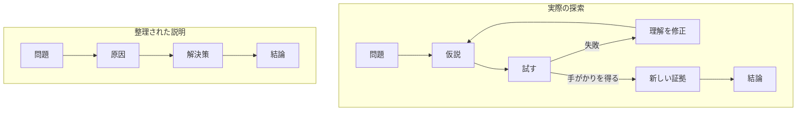
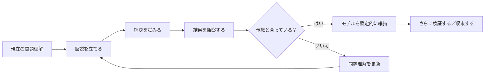
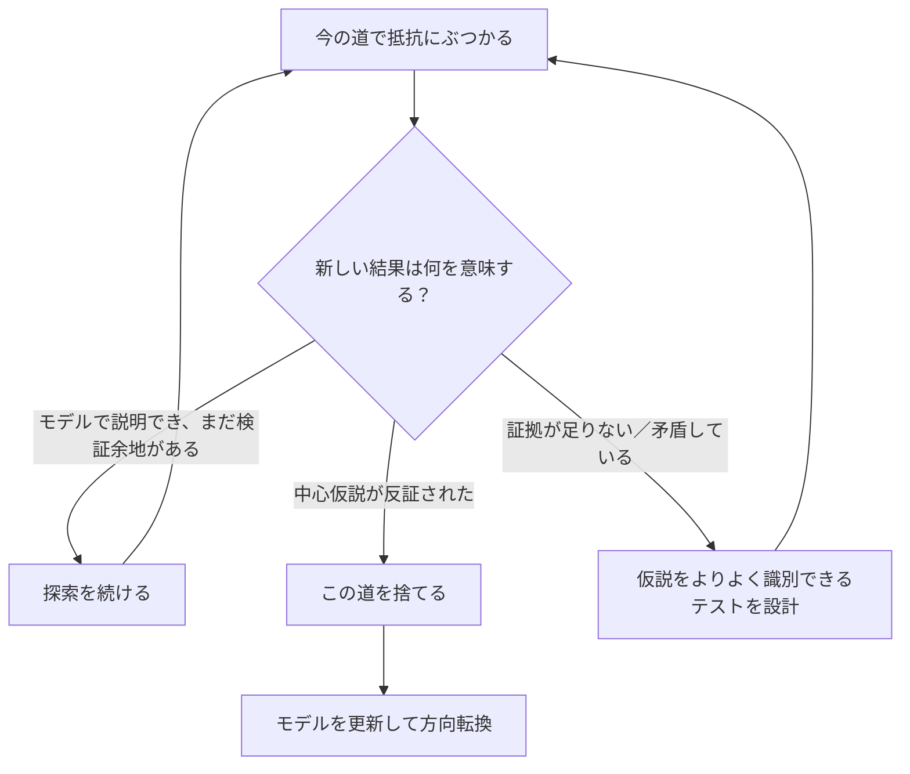
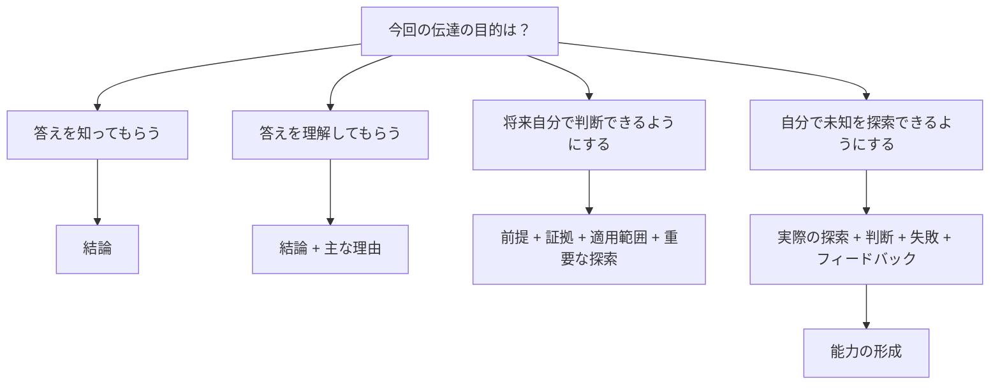

柴田史郎さんのある文章を読んで、興味深いズレについて考えるようになった。

説明をわかりやすく整理すると、受け手はときに「結論を理解するために必要な労力」を、「その結論にたどり着くために必要だった労力」と同じもののように感じてしまう。

数分で理解できる結論の裏に、数週間、数か月、あるいはそれ以上の探索があることは珍しくない。

実際に起きていたことは、たとえば次のようなものかもしれない。

整理された説明は間違っていない。むしろ、不要な枝葉を落とし、理解に必要な構造だけを残すことは、よい説明の条件でもある。

ただし、その過程で一つ大きなものが消える。

**答えが出る前に存在していた「未知」だ。**

最初に気になったのは、消えてしまった試行錯誤をどこまで残すべきか、ということだった。

しかし考えていくうちに、問いはもっと手前にあるのではないかと思うようになった。

> **「どこまで説明するか」を決める前に、そもそも今回の伝達によって相手に何を得てほしいのかを決める必要がある。**

## 答えを理解することと、答えを見つけられることは違う

ある人が三か月かけて問題を調べ、最後にこう説明したとする。

「X という理由から、B ではなく A を選んだ。」

私は五分で理解できるかもしれない。そして、その理解は本物だ。

ただし私が得たのは、**現在の条件では、なぜ A が妥当なのか**という理解である。

**条件が変わったときに、どうやってもう一度答えを探すのか**までは手に入っていない。

答えを知ることは知識であり、未知に向き合って答えを見つけ直すことは能力である。

この二つは同じではない。

だからこそ、「説明を聞けばわかる」と「自分でも未知の状態からもう一度たどり着ける」の間には、大きな隔たりがある。

## 探索で本当に難しいのは、未知を扱うこと

分野ごとに必要な専門知識は違う。

医学の知識がなければ医学的に意味のある仮説を立てにくいし、工学の背景がなければ、どの現象に注目すべきかすらわからないことがある。

それでも、その専門知識の上に、比較的分野を越えて共通する能力があるように思う。

**答えがわからないときに、どう進むか。**

たとえば、次のような問いを扱う力だ。

- 今、本当にわかっていることは何か。
- 観測した事実と、自分の解釈を分けられているか。
- どんな仮説があり得るか。
- 次に何を試せばよいか。
- どのテストなら、誤った方向をもっとも効率よく除外できるか。
- 予想と違う結果が出たのは、実行の問題なのか、モデルそのものの問題なのか。
- 方法を変えるべきなのか、それとも問題の定義から見直すべきなのか。

この意味では、「問題を理解すること」と「問題を解くこと」は、必ずしも別々の段階ではない。

問題を完全に理解してから解き始めるのではない。

むしろ、うまくいかなかった解決策を通して、初めて問題の正体が見えてくることも多い。

## 試行錯誤の価値は、数多く試すことではない

探索というと、「A がだめなら B、B がだめなら C」と順番に試すイメージを持ちやすい。

しかし、それだけなら単なる探索の総当たりに近い。

価値のある試行錯誤では、

> **一回ごとの結果が、次にどう考えるかを変える。**

たとえば X を信じていたのに Y が観測され、X が正しいなら本来 Y は起こらないはずだとする。

このとき重要なのは「今回失敗した」という事実だけではない。

「自分の問題モデルを修正しなければならない」という認識の変化こそが重要になる。

だから、残すべきものも必ずしも試行錯誤の全履歴ではない。

「A、B、C、D を試した」という一覧よりも、**何が判断を変えたのか**のほうが価値を持つことがある。

## それでも、探索の技術だけでは足りない。根性も要る

難しい問題は、安定して前向きな反応を返してくれるとは限らない。

答えが見えない。進んでいる実感がない。判断を何度も外す。方向が正しいのかわからない。そもそも満足できる答えが存在するのかさえ、わからない。

仮説の立て方や検証方法をよく知っていても、二、三回うまくいかなかっただけで探索から降りてしまえば、その能力は最後まで働かない。

そこで私は「根性」の意味を少し違う形で捉え直したくなる。

価値のある根性とは、

「今の道が絶対に正しいから、何があっても進む」ことではない。

むしろ、

> **まだ答えが見えなくても、問題の中にとどまり続けること。**

探索が十分な時間続くためには、この粘り強さが必要になる。

## しかし本当に難しいのは、いつ粘るのをやめるか

ここですぐに、別の問題が生まれる。

失敗には少なくとも二種類ある。

一つは、**道は合っているが、単純に難しい**場合。

もう一つは、**その道自体がすでに間違っている**場合だ。

前者には根性が必要だが、後者で粘り続ければ、沈没コストを増やしていくだけになる。

未知を本当に探索しているとき、「ここから先は間違いです」と赤信号が点くことはほとんどない。

証拠は不完全かもしれない。実験方法に問題があるかもしれない。結果にはノイズがあるかもしれない。自分の理解そのものが足りていないかもしれない。

それでも、続けるのか、修正するのか、方向転換するのか、捨てるのかを決めなければならない。

「簡単に諦めるな」と教えることはできるし、「沈没コストに注意しろ」と教えることもできる。

だが本当に難しいのは、その二つの教訓を知ることではない。

> **今この瞬間は、どちらなのか。**

この判断は、説明だけでそのまま他人に移すのが難しい。

早く諦めすぎて、あと一歩だったと後から気づく経験もある。逆に、長く粘りすぎて、中心仮説はとっくに崩れていたと認める経験もある。

そうした結果を何度も受け取ることで、少しずつ判断が校正されていく。

だから、よい意味での根性を表すなら、私はこう言いたい。

> **問題には執着する。仮説は疑う。証拠には従う。**

## 伝えられるものと、経験の中でしか形成されないもの

ここで最初の問題に戻ると、整理された説明から消えてしまった探索の意味も変わって見える。

「A → B → C → 答え」だけを見れば、結論はすぐ理解できる。

しかし実際に探索した人は、ある道が有望に見えたので進み、異常な結果が出たためまず実験を疑い、再検証したあとで初めて中心仮説が間違っていたと判断し、その道を捨てたかもしれない。

別の道では、最初の二回は失敗したものの、証拠が基本モデルをまだ支持していたため、もう一歩だけ進むと決め、そこで突破したかもしれない。

その人が得たのは、単なる出来事の記憶ではない。

**どんな失敗なら続ける価値があり、どんな失敗なら方向を変えるべきなのか。**

その判断そのものが少しずつ形成されている。

こうしたものは、詳細な文書を書けばそのまま別の人に渡せるとは限らない。

あるものは **knowledge transfer** で伝えられる。

しかし別のものは **capability formation**、つまり能力の形成に近い。

前者は説明で渡せる。後者には、実際の探索、判断、失敗、そしてフィードバックが必要になることが多い。

## だから問うべきは「過程をどれだけ残すか」ではない

ここまで考えると、逆に「探索が重要なら、すべての試行錯誤を残せばよい」と思いたくなる。

だが、それも違う。

大量の履歴は、そのまま大量のノイズにもなり得る。

ただ結論を知りたいだけの人に、三か月分の試行錯誤を全部渡しても、よいコミュニケーションにはならない。

問題は、

**「簡潔な説明がよいか、完全な説明がよいか」ではない。**

本当に問うべきなのは、

> **今回の伝達の目的は何か。**

答えを知ってもらうだけなら、結論だけで足りることがある。

理解してもらいたいなら、そこに主な理由を加える。

条件が変わっても自分で判断してほしいなら、現在の結論を支える前提、重要な条件、主要な代替案、判断を変えた証拠、そしてどんなときに結論を見直すべきかまで渡す必要がある。

さらに、相手にも未知の問題から新しい答えを見つけられるようになってほしいなら、説明だけでは足りないかもしれない。

形成しなければならないのは情報ではなく、探索する能力だからだ。

仮説を立てること。答えがない時間に耐えること。失敗からモデルを更新すること。道が間違っている可能性を見抜くこと。そして「もう少し続ける」と「ここで方向を変える」の間を判断すること。

## わかりやすさは悪くない

だから、私が最後にたどり着いたのは「簡略化に反対する」という結論ではない。

わかりやすい説明はよいものだ。情報を圧縮することは、コミュニケーションに不可欠でもある。

大切なのは、**何を圧縮しているのか、そして削ったものが今回の目的にとって本当に不要なのかを理解していること**だと思う。

説明が「簡略化しすぎ」かどうかは、長さでは決められない。

基準にすべきなのは、

> **その説明で、本来の伝達目的を達成できるか。**

私たちは説明するとき、つい最初に「何を話すか」を考える。

けれど、その前にもっと重要な問いがあるのかもしれない。

> **聞き終えたあと、相手に何ができるようになっていてほしいのか。**

知ってほしいなら、答えを渡す。

理解してほしいなら、理由を渡す。

判断してほしいなら、前提、証拠、適用範囲を渡す。

そして、いつか相手自身に答えを見つけてほしいなら、一つのきれいな説明だけでは渡せない能力があることを認めなければならない。

そう考えると、本当に重要な問いは「詳しく話すべきか、簡潔に話すべきか」ではない。

そのもっと手前にある。

> **今回、何のために伝えるのか。**

それを先に決めて初めて、何を残し、何を削り、何を説明し、そして何は説明だけでは渡せないのかを判断できる。

---

### この考察の出発点

この記事の出発点になったのは、柴田史郎さんの「[わかりやすい説明をすると「結論を理解する労力」が「その結論を導き出した労力」と誤解されるときがある](https://note.com/4bata/n/n0a44276a0ef1)」という文章である。

元の記事は、「整理されたわかりやすい説明」と、「実際に結論へたどり着くまでの試行錯誤」との間にある落差を扱っている。

ここではそこから一歩進めて、探索の過程をどこまで残すかを決める前に、まず **その伝達で何を実現したいのか** を決める必要があるのではないか、と考えた。
