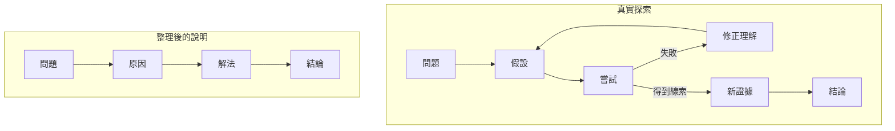
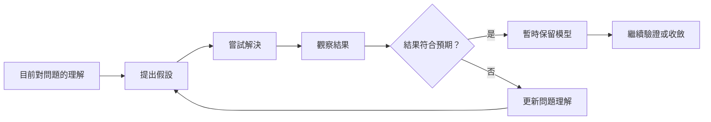
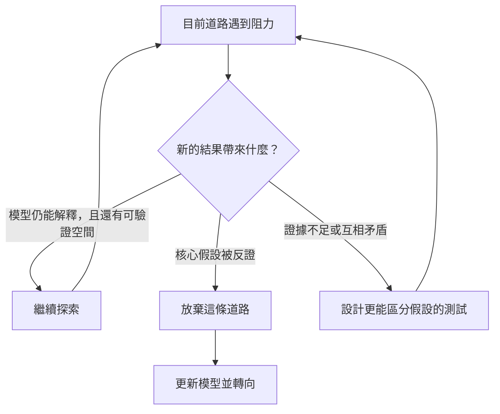
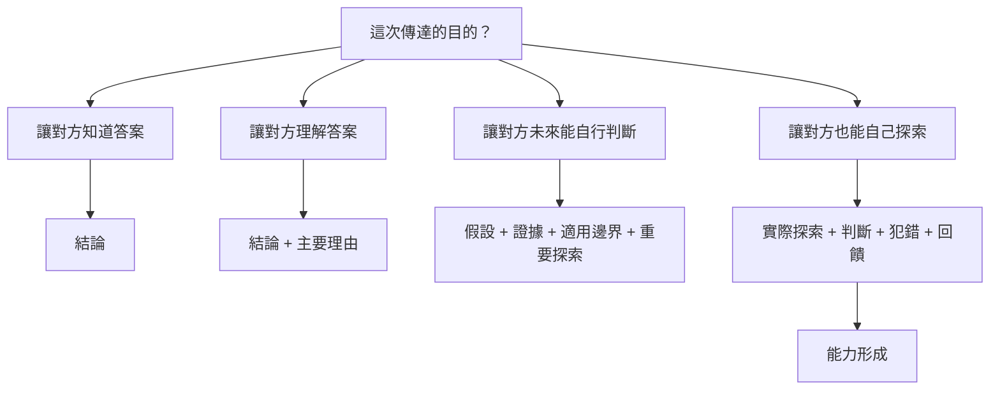

最近讀到柴田史郎的一篇文章，談到一個很有意思的落差：當我們把事情解釋得非常容易理解時，接收者有時會把「理解結論所需要的力氣」，誤認成「得到這個結論所需要的力氣」。

一個最後只需要幾分鐘就能理解的答案，背後可能經過幾週、幾個月，甚至更久的探索。

真實發生的事情可能像這樣：

整理後的說明沒有說謊。甚至可以說，這正是好的說明應該做的事：拿掉不必要的枝節，留下能讓人理解的結構。

但它同時刪掉了一件重要的東西：**答案產生之前所存在的未知。**

最初我在意的是，那些被刪掉的試行錯誤，到底該不該留下來？

後來我發現，真正的問題其實更前面。

> **在考慮「要說多少」以前，應該先問：我到底希望透過這次傳達，讓對方得到什麼？**

## 理解答案，不等於擁有找到答案的能力

假設一個人花了三個月研究某個問題，最後告訴我：

「因為 X，所以我們選擇 A，而不是 B。」

我可能五分鐘就理解了，而且是真的理解。

但我取得的是：**在目前這組條件下，為什麼 A 是合理答案。**

我不一定取得：**當條件改變之後，要如何重新找到答案。**

知道答案是一種知識；重新面對未知並找到答案，則是一種能力。兩者之間並不存在簡單的等號。

這也是為什麼「這個我懂」和「換成我自己，我也能重新做出來」常常是兩回事。

## 探索真正困難的，是管理未知

不同領域需要不同的專業知識。沒有醫學知識，很難提出好的醫學假設；沒有工程背景，也很難知道哪些現象值得注意。

但在這些專業知識之上，我認為還存在另一種相對共通的能力：

**當答案不知道的時候，要怎麼往前走。**

例如：

- 我現在真正知道的是什麼？
- 哪些是觀察到的事實，哪些只是我的解釋？
- 有哪些可能的假設？
- 下一步應該測試哪一個？
- 哪一個測試最能排除錯誤方向？
- 結果和預期不同，是執行有問題，還是模型本身有問題？
- 現在應該修改方法，還是重新定義問題？

因此，「理解問題」和「解決問題」往往也不是兩個明確分開的階段。

不是先把問題完全理解，再開始解決；很多時候，我們正是透過失敗的解法，才第一次真正理解問題。

## 試錯的價值，不在於試過很多東西

說到探索，很容易想到「試行錯誤」。

但 A 不行就試 B，B 不行再試 C，只能說是在搜索。真正有價值的試錯應該是：

> **每一次結果，都會改變下一次怎麼思考。**

如果我原本相信 X，但實驗得到 Y，而且如果 X 是對的，Y 理論上不應該發生，那麼真正重要的結果就不只是「這次失敗了」，而是「我對問題的模型需要修改」。

因此，真正值得保存的，也未必是完整的試錯歷史。

「我們曾經試過 A、B、C、D」本身的價值有限。更重要的是：**什麼資訊改變了我們的判斷。**

## 但光會探索還不夠：還需要根性

真正困難的問題，很少穩定地提供正向回饋。

更多時候是：不知道答案、沒有進展感、連續判斷錯誤、不知道方向對不對，甚至不知道最後到底有沒有一個令人滿意的答案。

如果一個人非常懂得建立假設，也懂得設計驗證，但只要兩三次沒有成果就退出，那麼他的探索能力依然無法真正運作。

因此，我開始重新理解「根性」的價值。

有價值的根性，不一定是「現在這條路無論如何都一定是對的」，而是：

> **即使暫時不知道答案，也願意繼續留在問題裡。**

它讓探索有足夠的時間發生。

## 真正困難的，是知道何時不該再堅持

但這裡馬上出現另一個問題。

失敗至少有兩種：

一種是，**這條路是對的，只是很難。**

另一種是，**這條路本身就是錯的。**

前者需要根性；後者如果繼續投入，只是在增加沉沒成本。

真正探索未知時，通常不會有一盞紅燈告訴你「這條路已經錯了」。證據可能不完整、實驗可能有問題、結果可能有雜訊，自己的理解也可能不完整。

即使如此，仍然必須作出判斷：繼續、修改、轉向，或者放棄。

我們可以教一個人「不要太早放棄」，也可以提醒他「要注意沉沒成本」。但真正困難的並不是知道這兩句話，而是：

> **現在這一次，到底屬於哪一種？**

這種判斷很難直接透過說明移植給另一個人。它更像長期經驗所形成的校準：曾經太早放棄，後來才發現其實只差一步；也曾經堅持太久，最後才承認核心假設早已失效。

所以我更願意把好的根性理解成：

> **對問題執著，對假設保持懷疑，對證據保持服從。**

## 有些東西可以傳達，有些只能形成

回頭看最初的問題，被整理掉的探索歷史就有了另一層意義。

如果一個人只看到「A → B → C → 答案」，他可以快速理解結果。

但真正參與探索的人，可能經歷過：某個方向看起來很有希望，投入一段時間後出現異常結果；他先懷疑測試，再重新驗證，最後才確認核心假設錯了，於是放棄那條路。

也可能有另一條路，前兩次都失敗，但證據仍然支持基本模型，因此決定再走一步，最後才突破。

真正參與這些過程的人，不只是多知道了一些歷史。他同時也在校準：

**什麼樣的失敗值得繼續，什麼樣的失敗意味著應該換方向。**

這種東西很難靠一份更詳細的文件直接交給另一個人。

有些東西是 **knowledge transfer**；有些東西更接近 **capability formation**。

前者可以靠說明。後者往往需要實際經歷、判斷、犯錯，以及回饋。

## 所以真正該問的，不是「過程要留下多少」

走到這裡，很容易得出另一個極端結論：既然探索如此重要，那就把所有過程完整保存下來。

我認為也不是。

大量歷史本身也可能只是大量雜訊。如果我只是想知道一件事情的結論，把三個月的所有試錯紀錄都丟給我，並不會讓溝通變得更好。

問題從來不是：

**「簡單的說明好，還是完整的說明好？」**

真正的問題是：

> **這次傳達的目的，到底是什麼？**

如果目的只是讓對方知道答案，結論可能就足夠。

如果目的是讓對方理解答案，需要再加上主要理由。

如果希望對方未來在條件改變後仍然能自己判斷，就還需要讓他知道：目前的結論建立在哪些假設上、哪些條件重要、有哪些主要替代方案、哪些證據真正改變過判斷，以及什麼情況下現在的結論應該重新被檢討。

而如果目的是希望對方有一天也能自己走進未知、找到新的答案，那麼單靠「說明」本身可能就不夠。

因為需要形成的已經不是資訊，而是探索能力：如何建立假設、如何承受沒有答案、如何從失敗更新模型、如何辨識道路可能已經錯了，以及如何在「再堅持一下」和「現在應該轉向」之間作判斷。

## 容易理解，並沒有錯

因此，我最後得到的結論不是反對簡化。

容易理解的說明很好。資訊壓縮也是溝通必要的一部分。

真正需要注意的是：**我們有沒有先知道自己正在壓縮什麼，以及那些被刪掉的東西對這次目的是否重要。**

一份說明是否「過度簡化」，不能單純以長度判斷。真正的標準應該是：

> **它是否仍然足以完成原本的傳達目的？**

我們習慣在溝通時先想：「我要告訴他什麼？」

也許更值得先問的是：

> **聽完之後，我希望他能做什麼？**

希望他知道，就給他答案。

希望他理解，就給他理由。

希望他能判斷，就讓他知道假設、證據與適用邊界。

希望他未來也能自己找到答案，就必須承認：有些能力無法透過一個漂亮的答案直接交給另一個人。

這樣回頭看，真正重要的問題也許從來不是「應該說得詳細一點，還是簡單一點？」

而是更前面的那一句：

> **我們這次傳達的目的，到底是什麼？**

只有先回答這個問題，我們才知道什麼應該留下、什麼可以刪掉、什麼需要說明，以及什麼根本不是靠說明就能傳達的。

---

### 思考的起點

本文的思考起點來自柴田史郎〈[わかりやすい説明をすると「結論を理解する労力」が「その結論を導き出した労力」と誤解されるときがある](https://note.com/4bata/n/n0a44276a0ef1)〉。

原文提出「整理後容易理解的說明」與「實際得到結論的試行錯誤」之間的落差。本文則從這個問題繼續往下思考：在決定保留多少探索過程以前，或許應該先問清楚——**這次傳達究竟希望完成什麼。**
